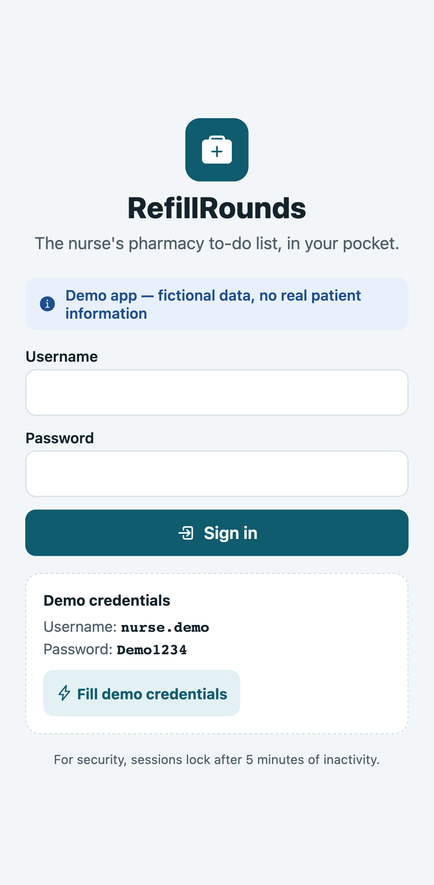
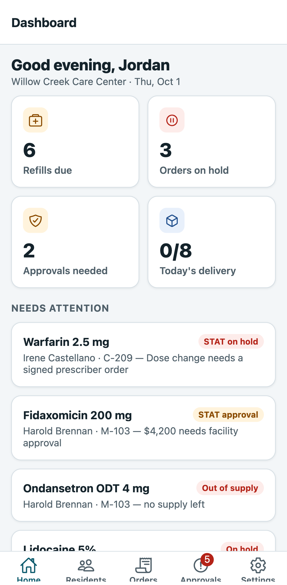
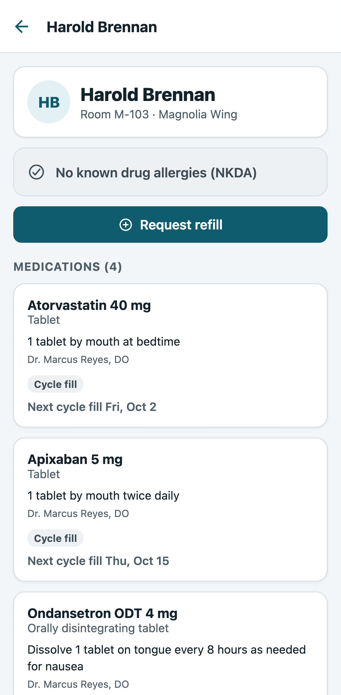
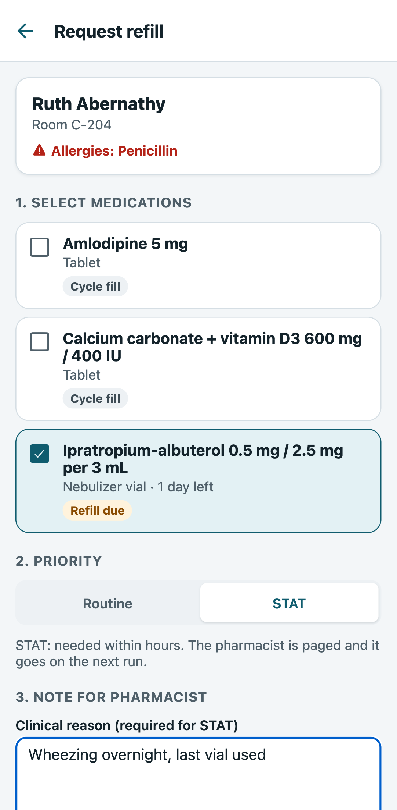
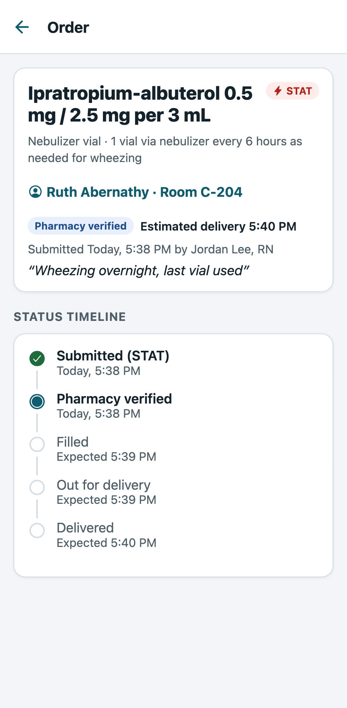
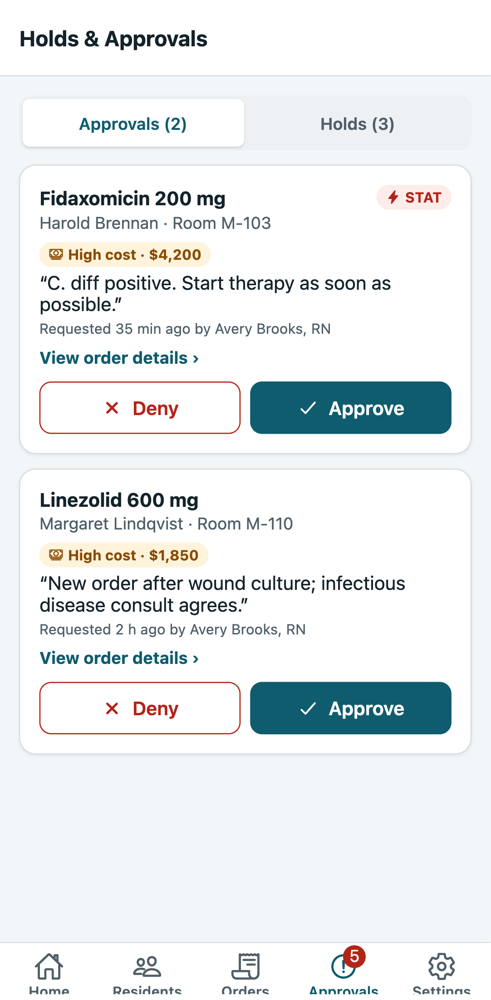
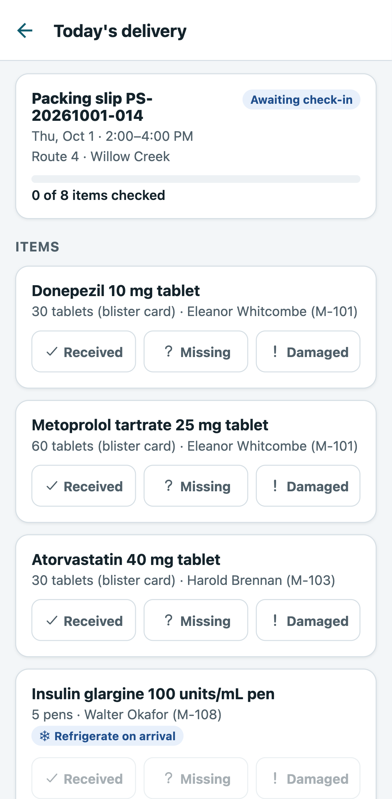
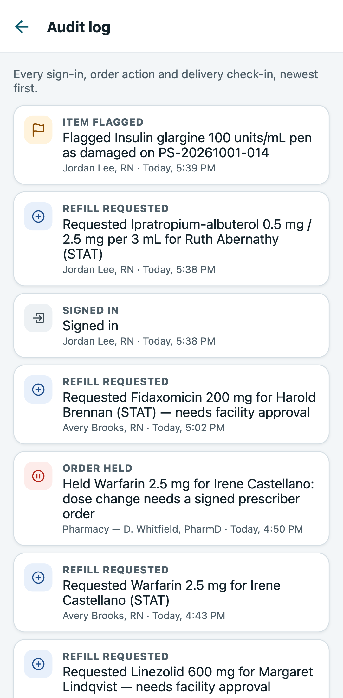
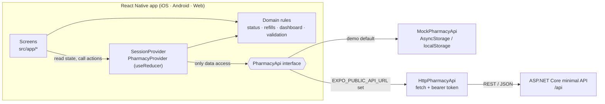

# RefillRounds

**The nurse's pharmacy to-do list, in their pocket.**

RefillRounds is a React Native (Expo) app for nurses in long-term care facilities. It covers the pharmacy
tasks that usually live in a desktop portal: requesting refills, clearing pharmacy holds, approving
high-cost medications and checking in the daily delivery. All of it runs from a phone on the med cart.

> **Demo app — fictional data, no real patient information.** Every resident, medication, staff
> member and the facility itself are made up.

**Live demo:** https://refillrounds.vercel.app (works on phone and desktop browsers)
Sign in with the demo credentials shown on the sign-in screen (`nurse.demo` / `Demo1234`), or tap
**Fill demo credentials**.

| Sign in | Dashboard | Resident profile | Request refill |
| --- | --- | --- | --- |
|  |  |  |  |

| Live order timeline | Holds & approvals | Delivery check-in | Audit log |
| --- | --- | --- | --- |
|  |  |  |  |

## What a nurse can do

- **Dashboard.** Counts for refills due, orders on hold, approvals needed and today's delivery. Each
  tile opens the matching list. A prioritized *Needs attention* list puts blocked STAT orders first.
- **Residents.** Search by name or room and filter by wing. The profile shows allergies prominently
  (or NKDA), every medication with its fill type (cycle fill, PRN, short course), days of supply and
  refill or order status.
- **Request a refill.** Pick one or more meds and choose Routine or STAT. STAT requires a clinical
  reason. A confirmation step follows. Meds with an open order can't be re-ordered. High-cost meds
  are flagged as needing facility approval before the request is sent.
- **Orders.** Open and completed orders with a status timeline:
  *Submitted → Pharmacy verified → Filled → Out for delivery → Delivered*. Status advances on its
  own, survives a page refresh and shows an estimated delivery time.
- **Holds & approvals.** Approve or deny high-cost medications (a reason is required to deny).
  Resolve pharmacy holds such as an expired prescription or insurance not covered.
- **Delivery check-in.** Work through today's packing slip, marking each item received, missing or
  damaged, then confirm. Refrigerated items are called out.
- **Audit log.** Every sign-in, order action and delivery check-in is recorded with who, what and when.
- **Settings.** Sign out, reset demo data, and an About section.

## Tech stack

| Area | Choice |
| --- | --- |
| App | React Native 0.86, Expo SDK 57, Expo Router (file-based routing), TypeScript (strict) |
| State | React Context + `useReducer` (no state library) |
| Data | `PharmacyApi` interface → `MockPharmacyApi` (AsyncStorage / localStorage, simulated latency) or `HttpPharmacyApi` |
| Backend (optional) | ASP.NET Core 10 minimal API in [`/api`](api), xUnit integration tests |
| Quality | ESLint, Jest + React Native Testing Library, Playwright E2E (Chrome + WebKit), GitHub Actions |
| Hosting | Vercel (static web export with SPA rewrites and security headers) |

## Architecture



- **Screens never touch storage or `fetch`.** They read from the providers and call actions such as
  `approveOrder(id)`. The providers call the `PharmacyApi` interface, and each response is applied to
  a reducer, so every screen and every dashboard count updates immediately.
- **Order status is computed, not stored.** It's derived from timestamps
  (`processingStartedAt` + a fixed step length), so it moves forward without timers or polling and is
  identical after a refresh.
- **Demo data is generated relative to today.** It regenerates automatically if it's from a previous
  day, so the demo never looks stale or empty.

More detail on every decision is in [ARCHITECTURE.md](ARCHITECTURE.md).

## REST contract

The mock and the ASP.NET Core API implement the same contract. Shapes match
[`src/models.ts`](src/models.ts) and [`api/RefillRounds.Api/Models.cs`](api/RefillRounds.Api/Models.cs):
camelCase JSON, enums as snake_case strings, ISO-8601 dates, and nulls omitted. Errors use
RFC 7807 problem details (`{ status, title, detail }`).

| Method | Endpoint | Body | Returns |
| --- | --- | --- | --- |
| POST | `/api/auth/sign-in` | `{ username, password }` | `{ token, session }` · 401 if wrong |
| POST | `/api/auth/sign-out` | `{ reason: "manual" \| "inactivity" }` | 204 |
| GET | `/api/auth/session` | | `Session` · 401 when expired |
| POST | `/api/auth/keep-alive` | | 204 |
| GET | `/api/facility` | | `Facility` |
| GET | `/api/residents` | | `Resident[]` |
| GET | `/api/medications` | | `Medication[]` |
| GET | `/api/orders` | | `Order[]` |
| POST | `/api/orders/refills` | `RefillRequest` | 201 `Order[]` · 400 invalid · 409 already ordered |
| POST | `/api/orders/{id}/approve` | | `Order` · 409 if not pending |
| POST | `/api/orders/{id}/deny` | `{ reason }` | `Order` · 400 if no reason |
| POST | `/api/orders/{id}/resolve-hold` | `{ resolution }` | `Order` · 409 if not on hold |
| GET | `/api/deliveries/today` | | `Delivery` |
| PATCH | `/api/deliveries/today/items/{itemId}` | `{ status }` | `Delivery` |
| POST | `/api/deliveries/today/confirm` | | `Delivery` · 400 until every item is checked |
| GET | `/api/audit-log` | | `AuditEntry[]` (newest first) |
| POST | `/api/demo/reset` | | 204 (demo only) |

All endpoints except sign-in require `Authorization: Bearer <token>`.

```csharp
public record RefillRequest(string ResidentId, IReadOnlyList<string> MedicationIds, Priority Priority, string? Note);

public record Order(
    string Id, string ResidentId, string MedicationId, Priority Priority, string? Note,
    DateTimeOffset SubmittedAt, string SubmittedBy,
    OrderHold? Hold, OrderApproval? Approval,
    DateTimeOffset? ProcessingStartedAt, IReadOnlyList<OrderEvent> History);

public record OrderHold(HoldReason Reason, string Detail, DateTimeOffset Since);          // renewal_needed | insurance_not_covered
public record OrderApproval(ApprovalState State, decimal EstimatedCost,                     // pending | approved | denied
    DateTimeOffset? DecidedAt = null, string? DecidedBy = null, string? DenialReason = null);
```

## Security and compliance

This is a demo, so it deliberately holds **no PHI**: all data is fictional and stays in the
browser (or the local API). What it does demonstrate:

- **Session auto-lock** after 5 minutes of inactivity (any touch, click, key or scroll counts). The
  last-activity time is saved, so the timeout also applies after a refresh or when the app is reopened.
  The .NET API enforces the same timeout on the server.
- **Audit trail.** Every state-changing action records user, action and time. Denials require a
  reason.
- **Server-side rules.** The API (and the mock, which behaves like a server) re-validates
  everything: STAT reasons, deny reasons, duplicate orders and state transitions (409 Conflict).
- **Least exposure on the web.** `X-Frame-Options: DENY`, `X-Content-Type-Options: nosniff`, a strict
  referrer policy, and camera/microphone/location disabled through `Permissions-Policy`.

**What a production version would add:**

- Real authentication through the organization's identity provider (Entra ID / SSO with OIDC and PKCE),
  MFA, and short-lived access tokens with refresh tokens
- Role-based access (nurse, charge nurse, DON, pharmacist), scoped to the user's facility and unit
- Tokens stored in iOS Keychain / Android Keystore (`expo-secure-store`), not AsyncStorage, and no
  PHI cached on the device
- HIPAA-eligible hosting under a BAA (e.g. Azure App Service + Azure SQL with TDE), TLS everywhere,
  encryption at rest
- Tamper-evident, append-only audit storage with retention policies
- Mobile device management, jailbreak/root detection, screenshot protection on PHI screens
- Content-Security-Policy, rate limiting, and centralized logging and monitoring without PHI in logs

## Testing

| Layer | What | Run |
| --- | --- | --- |
| Unit (58 tests) | Status progression, refill-due rules, dashboard counts and ranking, reducer actions, validation, mock API business rules, confirm dialog | `npm test` |
| E2E (Playwright) | Full nurse workflow from a first visit with empty storage, refresh on detail routes, unknown IDs, inactivity lock, desktop layout. Fails on **any** console error or warning. Runs on mobile Chrome, mobile Safari (WebKit) and desktop Chrome | `npm run e2e` |
| API (xUnit, 10 tests) | Auth, 401/400/409 handling, JSON contract, approvals, holds, delivery, server-side timeout with a fake clock | `cd api && dotnet test` |

CI ([`.github/workflows`](.github/workflows)) runs typecheck, lint, unit tests, the web build and the
API tests on every push. The E2E suite runs against the live site on demand and nightly.

## Running locally

```bash
npm install
npm run web          # browser at http://localhost:8081
npm start            # Expo dev server; scan the QR code with Expo Go
npm run check        # typecheck + lint + unit tests
```

**On your phone (Expo Go):** install **Expo Go** from the App Store or Google Play (it must support
SDK 57). Run `npm start` on a computer on the same Wi-Fi network and scan the QR code: with the Camera
app on iPhone, or from inside Expo Go on Android. If the networks differ, use `npx expo start --tunnel`.

**With the ASP.NET Core API instead of the mock:**

```bash
cd api/RefillRounds.Api && dotnet run          # http://localhost:5005
EXPO_PUBLIC_API_URL=http://localhost:5005 npm run web
```

(On a phone, use your computer's LAN IP instead of `localhost`.)

## Known limitations

- **Data lives in each browser.** The demo uses local storage, so every visitor has their own copy,
  and two open tabs can overwrite each other's changes.
- **Time is compressed.** Order steps take 30 s (STAT) or 60 s (routine) so the flow can be seen in a
  demo. Real pharmacy turnaround is measured in hours.
- **Daily refresh.** Demo data regenerates when the calendar day changes, which discards earlier
  changes. That's intentional.
- **Authentication is simulated.** There's one demo account and its credentials are shown on screen.
- **Native notifications and barcode scanning aren't implemented.** They were cut in favor of
  reliability and the .NET API.
- **Device coverage.** Automated tests cover the web build in Chrome and WebKit (Safari's engine).
  The native app runs the same code through Expo Go but has no automated device tests.
- **The .NET API is in-memory and single-instance.** Restarting it resets data.

## Next steps

1. Persist the API with EF Core + SQL Server and add role-based authorization.
2. Push notifications when a STAT order is out for delivery.
3. Barcode scanning of blister cards during delivery check-in (`expo-camera`).
4. Offline queue for actions taken without connectivity, synced on reconnect.
5. EAS Build for signed Android and iOS builds, plus OTA updates with EAS Update.
